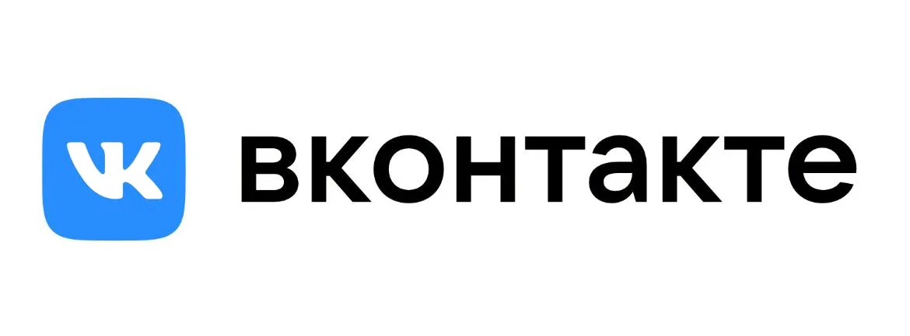

 # 
 Привет👋 Меня зовут Николай! 
 

 

  

###

  
  

###

### Мои проекты, выполненные в ходе обучения:

**Задание:**  

###

**Задание:**  

###

 

###

<h3 align="left">🛠 Технологии:</h3>

### 

  &nbsp
&nbsp
  &nbsp
  &nbsp
  &nbsp
  &nbsp
  &nbsp
&nbsp
 &nbsp
  &nbsp
  &nbsp
  

  

  &nbsp
  &nbsp
 

